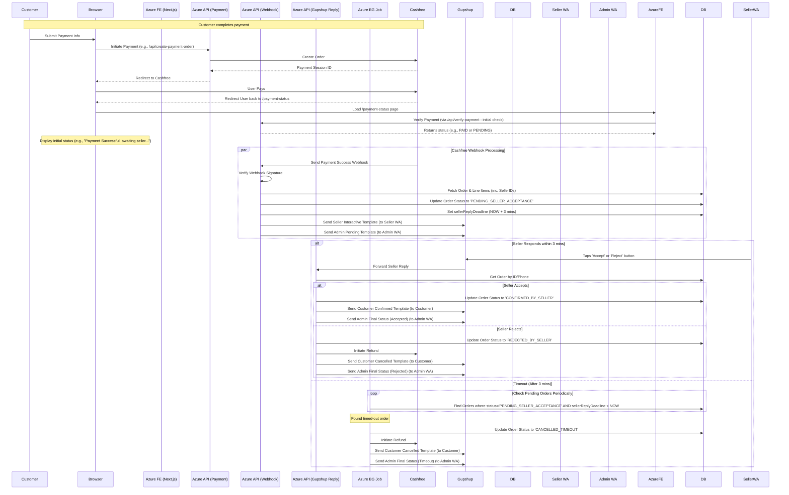

# Seller Order Confirmation Flow

This document outlines the sequence of events for processing an order with seller confirmation via WhatsApp after successful customer payment.

## Requirements Summary

*   5 Approved Gupshup Templates (Seller Interactive, Admin Pending, Admin Final, Customer Confirmed, Customer Cancelled)
*   Modified Cashfree Webhook Handler API Route
*   New Gupshup Reply Handler API Route
*   Database schema updates (Order Status, Seller Reply Deadline)
*   Seller & Customer Phone Numbers in DB
*   Cashfree Refund API Integration
*   Background Job Runner (for timeouts)
*   Updated Environment Variables (Template IDs, Admin Phone)
*   Gupshup App configuration pointing to Reply Handler URL

## Workflow Diagram

*Note: Error handling and detailed logic within each step are simplified for clarity.* 